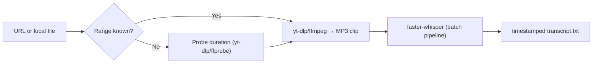

# URL/Local file → Audio → Whisper Transcript

Download/clip audio from a URL or local file and generate a timestamped transcript with faster-whisper. Minimal, fast, and scriptable.

* **URL or local input:** YouTube links or files on disk.
* **Clip range:** `--start/--end` in `HH:MM:SS` (or use defaults in the script).
* **Job-based runs:** each source → its own `run_YYYYMMDD_HHMMSS_xxx/`.
* **GPU optional:** works on CPU; CUDA speeds things up if available.
* **Straightforward outputs:** `audio.mp3` and `transcript.txt`.

<details>
<summary><strong>Pipeline (diagram)</strong></summary>



</details>

## Requirements

* Python ≥ 3.11
* `ffmpeg` on PATH
* `pip install -r requirements.txt`
* (Optional) PyTorch with CUDA for GPU
* (Recommended) Keep `yt-dlp` up to date

## Quickstart

One or more sources:

```bash
python clip2txt.py "https://youtu.be/CPBJgpK0Ulc" "C:\path\to\local\audio.mp3"
```

Clip range, output dir, model:

```bash
python clip2txt.py "SOURCE_URL_OR_PATH" --start 00:01:00 --end 00:03:30 -o output -m medium --compute-type int8_float32
```

## CLI

```text
python clip2txt.py [SOURCES ...]
                   [--start HH:MM:SS]
                   [--end HH:MM:SS]
                   [-o OUTDIR]
                   [-m MODEL]
                   [--compute-type TYPE]
```

| Option              | Description                              | Default (from script) |
| ------------------- | ---------------------------------------- | --------------------- |
| `SOURCES ...`       | URLs or file paths (zero or more)        | `SOURCES`             |
| `--start HH:MM:SS`  | Clip start                               | `START_TS`            |
| `--end HH:MM:SS`    | Clip end                                 | `END_TS`              |
| `-o, --outdir PATH` | Output folder                            | `OUTDIR`              |
| `-m, --model NAME`  | Whisper model (`tiny` … `large-v2`)      | `MODEL`               |
| `--compute-type T`  | Compute type (`int8`, `int8_float32`, …) | `COMP_TYPE`           |

Outputs per source end up in `output/run_YYYYMMDD_HHMMSS_xxx/` with `audio.mp3` and `transcript.txt`.
